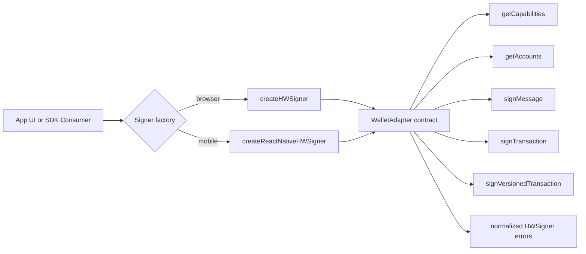
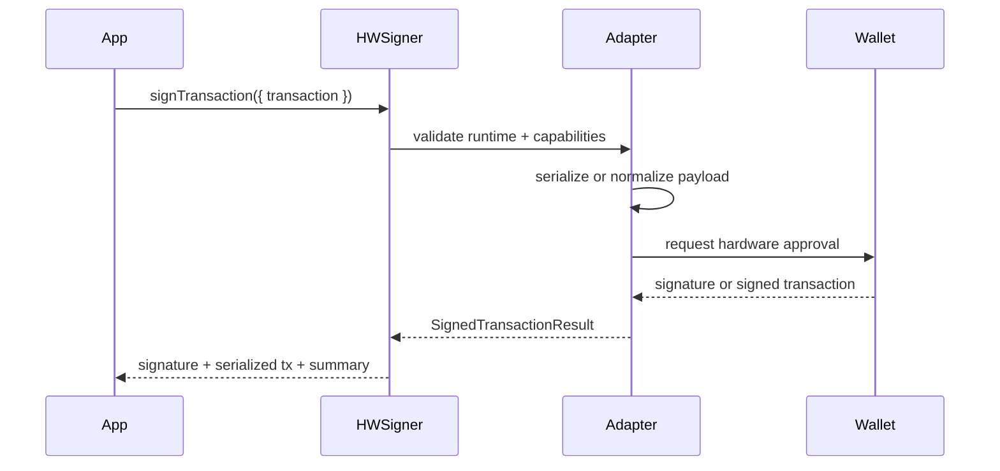

# HWSigner

HWSigner is an adapter-based TypeScript SDK prototype for Solana hardware wallets.

The idea is simple: an app should not need a custom Ledger integration, a separate Trezor flow, a different QR signer path, a WalletConnect edge case, and another branch for React Native NFC. It should ask one object what the selected wallet can do, then call the same signing methods everywhere.

The important part is the SDK shape: one API, typed capabilities, honest runtime boundaries, and room for more hardware wallets without rewriting app code.

## What Is Included

| Area | What is here now |
|---|---|
| Web playground | Next.js App Router demo with wallet/runtime selector, account derivation, message signing, transaction signing, event log, and code examples. |
| Core SDK shape | Shared `WalletAdapter` contract, typed runtime configs, normalized errors, capability reporting, Solana transaction helpers. |
| Ledger | WebHID real-device runtime and local Speculos runtime through Next.js route handlers. |
| Other wallet paths | Experimental adapters for Trezor, Keystone, SafePal, OneKey, SecuX, CoolWallet, Cypherock, D'CENT, ELLIPAL, Tangem, Arculus, BC Vault, GridPlus, KeyPal, and Solflare Shield. |
| React Native | Separate `createReactNativeHWSigner` entrypoint with Tangem NFC, Keystone QR, and injected WalletConnect client paths. |
| Tests | Vitest coverage for utility helpers, adapter capability shapes, Ledger/Speculos logic, error mapping, and React Native support mapping. |

## Current Project Status

This project is package-first, but the package is not published yet.

`package.json` is still marked:

```json
{
  "private": true
}
```

Support labels used throughout the repo:

| Label | Meaning |
|---|---|
| Live | Primary working path in this repo. |
| Experimental | Adapter exists, but depends on vendor SDKs, browser APIs, WalletConnect, or physical-device validation. |
| Adapter-ready | HWSigner wrapper exists, but the host app must inject a native/WalletConnect client. |
| Planned | Not implemented honestly yet because a public adapter path or native transport is missing. |
| Web-only | Current implementation depends on browser-only providers. |

## Architecture

The core design is intentionally small:

1. A runtime config describes how the wallet is reached.
2. A wallet adapter wraps the vendor-specific SDK or transport.
3. App code calls the same methods for all wallets.
4. Capabilities tell the UI what is actually supported.



The runtime layer is where the wallet-specific reality lives:

```mermaid
flowchart TB
  Contract[WalletAdapter contract]

  Contract --> Direct[Direct browser transports]
  Direct --> Ledger[Ledger WebHID]
  Direct --> OneKey[OneKey WebUSB]
  Direct --> SecuX[SecuX WebUSB]
  Direct --> CoolWallet[CoolWallet Web BLE]
  Direct --> Cypherock[Cypherock WebUSB]

  Contract --> Bridge[Bridge and emulator flows]
  Bridge --> Speculos[Ledger Speculos route handlers]
  Bridge --> Trezor[Trezor Connect]

  Contract --> QR[QR and WalletConnect flows]
  QR --> Keystone[Keystone QR]
  QR --> Dcent[D'CENT WalletConnect]
  QR --> Ellipal[ELLIPAL WalletConnect]
  QR --> Tangem[Tangem WalletConnect]
  QR --> Arculus[Arculus WalletConnect]
  QR --> BCVault[BC Vault WalletConnect]

  Contract --> Provider[Injected provider flows]
  Provider --> SafePal[SafePal provider]
  Provider --> GridPlus[GridPlus via NuFi]
  Provider --> KeyPal[KeyPal via TokenPocket]

  Contract --> Native[React Native injected clients]
  Native --> TangemNfc[Tangem native NFC]
  Native --> KeystoneQr[Keystone native QR client]
  Native --> RnWc[React Native WalletConnect client]
```



## Signing Flow

The app passes native `@solana/web3.js` objects into HWSigner. The adapter decides how that object has to be sent to the device.



For Ledger specifically, HWSigner exposes `signingPayloadMode` because different Ledger app/runtime combinations may accept different payload shapes:

| Mode | Used for |
|---|---|
| `serialized-transaction` | Full serialized legacy or versioned transaction bytes. |
| `legacy-message-bytes` | Legacy transaction message bytes. |
| `versioned-message-bytes` | Versioned transaction message bytes. |

Most provider and WalletConnect adapters use `serialized-transaction`.

## Quick Start

Install dependencies:

```bash
npm install
```

Run the playground:

```bash
npm run dev
```

Run tests:

```bash
npm test
```

Build:

```bash
npm run build
```

Optional Ledger Speculos smoke path (coz i tested in that emulator):

```bash
npm run smoke:ledger:speculos
```

The smoke script expects a local Speculos instance and is not part of the normal test suite.

## Environment Variables

| Variable | Used for |
|---|---|
| `NEXT_PUBLIC_ENABLE_SPECULOS=true` | Shows and enables the local-only Ledger Speculos runtime in development. |
| `NEXT_PUBLIC_WALLETCONNECT_PROJECT_ID` | Enables WalletConnect-backed web runtimes such as D'CENT, ELLIPAL, Tangem, Arculus, and BC Vault. |

## Browser Example

```ts
import { Connection, PublicKey, SystemProgram, Transaction } from '@solana/web3.js';
import { createHWSigner } from '@/lib/hwsigner/create-signer';

const signer = createHWSigner({
  walletId: 'ledger',
  runtime: { kind: 'real-device', transport: 'webhid' },
  onEvent: (event) => console.log(event.type, event.message),
});

await signer.connect();

const [account] = await signer.getAccounts({
  startIndex: 0,
  count: 1,
});

const connection = new Connection('https://api.devnet.solana.com', 'confirmed');
const { blockhash } = await connection.getLatestBlockhash();

const transaction = new Transaction({
  feePayer: new PublicKey(account.address),
  recentBlockhash: blockhash,
}).add(
  SystemProgram.transfer({
    fromPubkey: new PublicKey(account.address),
    toPubkey: new PublicKey('DRpbCBMxVnDK7maPMoGQfFiRLNGhFM1M7J9sX9g3BJ2j'),
    lamports: 1_500_000,
  }),
);

const signed = await signer.signTransaction({
  derivationPath: account.path,
  transaction,
  signingPayloadMode: 'serialized-transaction',
});

console.log(signed.signature);
```

## React Native Guide

React Native uses a separate entrypoint so mobile apps do not import browser-only WebHID, WebUSB, or Web Bluetooth paths.

```ts
import { createReactNativeHWSigner } from '@/lib/react-native';
```

### Tangem NFC

Tangem is the most concrete native path in the repo. The app owns the NFC session by injecting a Tangem React Native SDK object.

```ts
import { createReactNativeHWSigner } from '@/lib/react-native';
import RNTangemSdk from 'tangem-sdk-react-native';

const signer = createReactNativeHWSigner({
  walletId: 'tangem',
  runtime: {
    kind: 'tangem-react-native-nfc',
    transport: 'nfc',
    sdk: RNTangemSdk,
    defaultDerivationPath: "m/44'/501'/0'/0'",
  },
});

await signer.connect();
const [account] = await signer.getAccounts({ startIndex: 0, count: 1 });
```

### Keystone QR

Keystone needs a native camera/UR flow. HWSigner does not fake that scanner; it expects the React Native app to provide a compatible wallet client.

```ts
import {
  createReactNativeHWSigner,
  type ReactNativeSolanaWalletClient,
} from '@/lib/react-native';

declare const wallet: ReactNativeSolanaWalletClient;

const signer = createReactNativeHWSigner({
  walletId: 'keystone',
  runtime: {
    kind: 'react-native-keystone-qr',
    transport: 'qr',
    wallet,
    walletName: 'Keystone',
  },
});
```

### WalletConnect-backed mobile wallets

D'CENT, ELLIPAL, Arculus, BC Vault, Tangem, and Solflare Shield can use the generic React Native WalletConnect wrapper when the app injects a Solana wallet client.

```ts
import {
  createReactNativeHWSigner,
  type ReactNativeSolanaWalletClient,
} from '@/lib/react-native';

declare const wallet: ReactNativeSolanaWalletClient;

const signer = createReactNativeHWSigner({
  walletId: 'dcent',
  runtime: {
    kind: 'react-native-walletconnect',
    transport: 'deep-link',
    wallet,
    walletName: "D'CENT",
  },
});
```

## Wallet Support Map

This table is intentionally conservative. It describes what this repository exposes today, not every feature a vendor may support in its own app.

| Wallet | Web path | React Native path | Notes |
|---|---|---|---|
| Ledger | Live: WebHID and Speculos | Planned | Requires Solana app open. RN needs native BLE/USB validation. |
| Trezor | Experimental: Trezor Connect | Planned | Transaction signing through Connect; message signing is not exposed. |
| Keystone | Experimental: QR | Adapter-ready: QR client | RN app must provide camera/UR client. |
| SafePal | Experimental: injected provider | Web-only | Browser extension or SafePal in-app browser path. |
| OneKey | Experimental: WebUSB | Planned | RN needs native USB/BLE path. |
| SecuX | Experimental: WebUSB | Planned | RN needs native USB/BLE path. |
| CoolWallet | Experimental: Web BLE | Planned | RN needs native BLE path. |
| Cypherock | Experimental: WebUSB | Planned | Legacy transaction path only in current adapter. |
| D'CENT | Experimental: WalletConnect | Adapter-ready: WalletConnect | Requires `NEXT_PUBLIC_WALLETCONNECT_PROJECT_ID` for web demo. |
| ELLIPAL | Experimental: WalletConnect | Adapter-ready: WalletConnect | Requires mobile app validation. |
| Tangem | Experimental: WalletConnect | Implemented: NFC, adapter-ready: WalletConnect | Native NFC path expects injected Tangem RN SDK. |
| Arculus | Experimental: WalletConnect | Adapter-ready: WalletConnect | NFC card confirmation happens in Arculus app. |
| BC Vault | Experimental: WalletConnect | Adapter-ready: WalletConnect | Uses BC Vault Desktop app path. |
| GridPlus Lattice1 | Experimental: NuFi provider | Web-only | Requires a NuFi-backed Lattice account. |
| KeyPal | Experimental: TokenPocket provider | Web-only | Requires TokenPocket provider. |
| Solflare Shield | Experimental: Solflare SDK | Adapter-ready: WalletConnect | HWSigner cannot directly inspect the Shield card. |
| NGRAVE | Planned | Planned | Waiting on a verified public Solana adapter path. |

## Capability Snapshot

| Runtime family | Connect | Accounts | Sign message | Sign legacy tx | Sign v0 tx | Browser | React Native |
|---|---:|---:|---:|---:|---:|---:|---:|
| Ledger WebHID | Yes | Yes | Yes | Yes | Yes | Yes | No |
| Ledger Speculos | Yes | Yes | Yes | Yes | Yes | Local only | No |
| Trezor Connect | Yes | Yes | No | Yes | Yes | Yes | No |
| Keystone QR | Yes | Yes | Yes | Yes | Yes | Yes | Adapter-ready |
| WalletConnect adapters | Yes | Yes | Yes | Yes | Yes | Yes | Adapter-ready for selected wallets |
| Injected provider adapters | Yes | Yes | Varies | Yes | Varies | Yes | No |
| Tangem native NFC | Yes | Yes | Yes | Yes | Yes | No | Yes |

## Public API

All adapters implement the same shape:

```ts
interface WalletAdapter {
  connect(): Promise<HWSignerConnection>;
  disconnect(): Promise<void>;
  getCapabilities(): HWSignerCapabilities;
  getAppConfiguration(): Promise<HWSignerAppConfiguration | null>;
  getAccounts(input: GetAccountsInput): Promise<HWSignerAccount[]>;
  signMessage(input: SignMessageInput): Promise<SignedMessageResult>;
  signTransaction(input: SignTransactionInput): Promise<SignedTransactionResult>;
  signVersionedTransaction(input: SignVersionedTransactionInput): Promise<SignedTransactionResult>;
}
```

### `createHWSigner(options)`

Creates a browser adapter.

```ts
const signer = createHWSigner({
  walletId: 'ledger',
  runtime: { kind: 'real-device', transport: 'webhid' },
  onEvent: (event) => console.log(event.message),
});
```

### `createReactNativeHWSigner(options)`

Creates a React Native adapter.

```ts
const signer = createReactNativeHWSigner({
  walletId: 'tangem',
  runtime: {
    kind: 'tangem-react-native-nfc',
    transport: 'nfc',
    sdk: RNTangemSdk,
  },
});
```

### `connect()`

Starts the selected runtime and returns connection metadata.

```ts
const connection = await signer.connect();
```

```ts
interface HWSignerConnection {
  walletId: HWWalletId;
  walletName: string;
  runtime: HWSignerRuntime;
  capabilities: HWSignerCapabilities;
  appConfiguration: HWSignerAppConfiguration | null;
}
```

### `getCapabilities()`

Returns what this adapter/runtime says it can do right now.

```ts
const capabilities = signer.getCapabilities();
```

```ts
interface HWSignerCapabilities {
  connect: boolean;
  disconnect: boolean;
  getAccounts: boolean;
  signMessage: boolean;
  signTransaction: boolean;
  signVersionedTransaction: boolean;
  emulator: boolean;
  usb: boolean;
  ble: boolean;
  qr: boolean;
  nfc: boolean;
}
```

### `getAccounts(input)`

Returns one or more accounts. Hardware derivation paths are normalized into the shared `HWSignerAccount` shape.

```ts
const accounts = await signer.getAccounts({
  startIndex: 0,
  count: 3,
});
```

```ts
interface HWSignerAccount {
  index: number;
  path: string;
  address: string;
}
```

### `signMessage(input)`

Signs message bytes or a UTF-8 string.

```ts
const result = await signer.signMessage({
  derivationPath: "m/44'/501'/0'/0'",
  message: 'hello from HWSigner',
});
```

### `signTransaction(input)`

Signs a native `@solana/web3.js` `Transaction`.

```ts
const result = await signer.signTransaction({
  derivationPath: account.path,
  transaction,
  signingPayloadMode: 'serialized-transaction',
});
```

### `signVersionedTransaction(input)`

Signs a native `@solana/web3.js` `VersionedTransaction`.

```ts
const result = await signer.signVersionedTransaction({
  derivationPath: account.path,
  transaction: versionedTransaction,
  signingPayloadMode: 'serialized-transaction',
});
```

### Signed transaction result

```ts
interface SignedTransactionResult {
  address: string;
  derivationPath: string;
  signature: string;
  version: 'legacy' | 'v0';
  recentBlockhash: string;
  serializedTransactionBase64: string;
  transactionSummary: TransactionSummary;
}
```

## Per-wallet Setup Notes

| Wallet | What to prepare |
|---|---|
| Ledger | Open the Solana app on the device. Use a WebHID-capable browser for real-device mode. Enable Speculos only locally with `NEXT_PUBLIC_ENABLE_SPECULOS=true`. |
| Trezor | Expect the Trezor Connect popup/bridge flow. Message signing is not enabled in this adapter. |
| Keystone | Browser path uses Keystone QR. React Native path needs a native camera/UR client injected by the app. |
| SafePal | Use the SafePal extension or SafePal in-app browser provider. |
| OneKey | Use a WebUSB-capable browser and a physical OneKey device. |
| SecuX | Use a WebUSB-capable browser and a physical SecuX device. |
| CoolWallet | Use a browser with Web Bluetooth support and pair the card over BLE. |
| Cypherock | Use WebUSB and the vendor SDK path. Current adapter does not expose message signing or versioned transactions. |
| D'CENT / ELLIPAL / Arculus / BC Vault / Tangem WalletConnect | Set `NEXT_PUBLIC_WALLETCONNECT_PROJECT_ID` and validate with the vendor mobile/desktop app. |
| Tangem React Native | Inject the Tangem React Native SDK as `runtime.sdk`. |
| Solflare Shield | Use Solflare Wallet SDK. The user must select a Shield-backed account; HWSigner does not directly inspect the card. |
| GridPlus Lattice1 | Use the NuFi provider with a Lattice-backed account. |
| KeyPal | Use the TokenPocket provider with a KeyPal-backed account. |
| NGRAVE | Not integrated yet. Waiting on a public Solana adapter path. |

## Tests and Scripts

```bash
npm test
npm run build
npm run smoke:ledger:speculos
```

`smoke:ledger:speculos` is opt-in and expects a running local Speculos instance. The normal test suite does not require hardware.

Current test coverage includes:

- derivation path helpers;
- message normalization;
- Solana transaction serialization and summary helpers;
- Ledger and Speculos behavior;
- adapter capability shapes;
- error normalization;
- React Native support mapping.

## Troubleshooting

### WebHID is not available

Use Chrome or Edge on desktop, run the app from `localhost` or HTTPS, and check that browser device permissions are not blocked.

### Ledger connects but signing fails

Make sure the Solana app is open on the Ledger. If the transaction is more complex than the device can clear-sign, enable blind signing in the Solana app settings.

### Speculos does not appear in the playground

Set:

```bash
NEXT_PUBLIC_ENABLE_SPECULOS=true
```

Then restart the dev server. Speculos is deliberately hidden/disabled outside local development.

### WalletConnect runtimes are disabled

Set:

```bash
NEXT_PUBLIC_WALLETCONNECT_PROJECT_ID=<project-id>
```

Then restart the dev server.

### `bigint: Failed to load bindings`

This is a dependency fallback warning. It is noisy, but the current repo still passes `npm test` and `npm run build`.

### Is this already published to npm?

No. The SDK shape is here, but publish metadata is not finalized yet. The next step is to add package exports, build output, `files` when ready.
